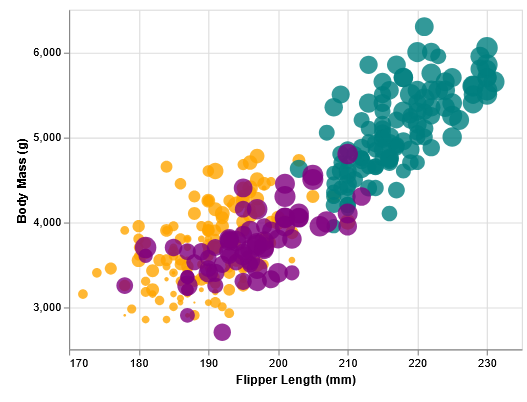
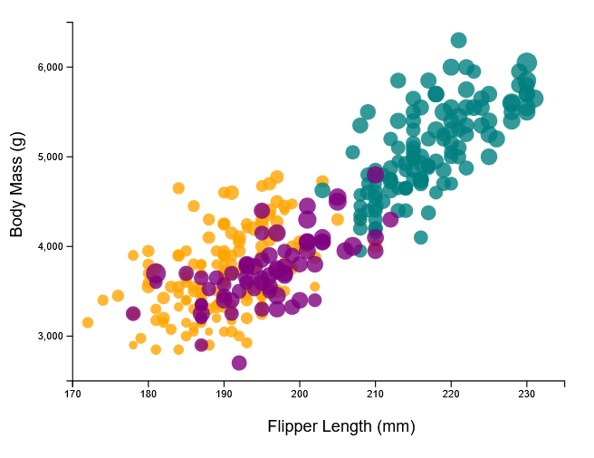
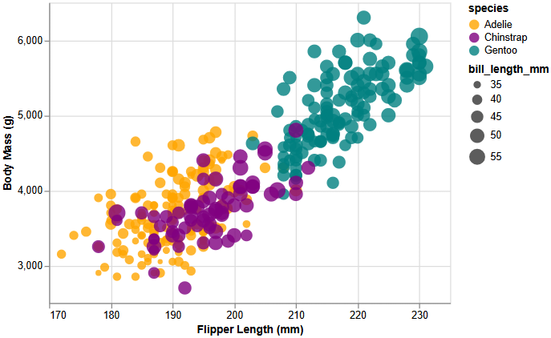
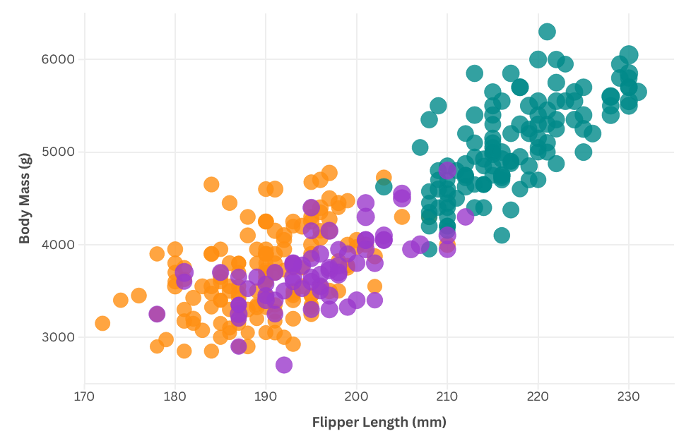
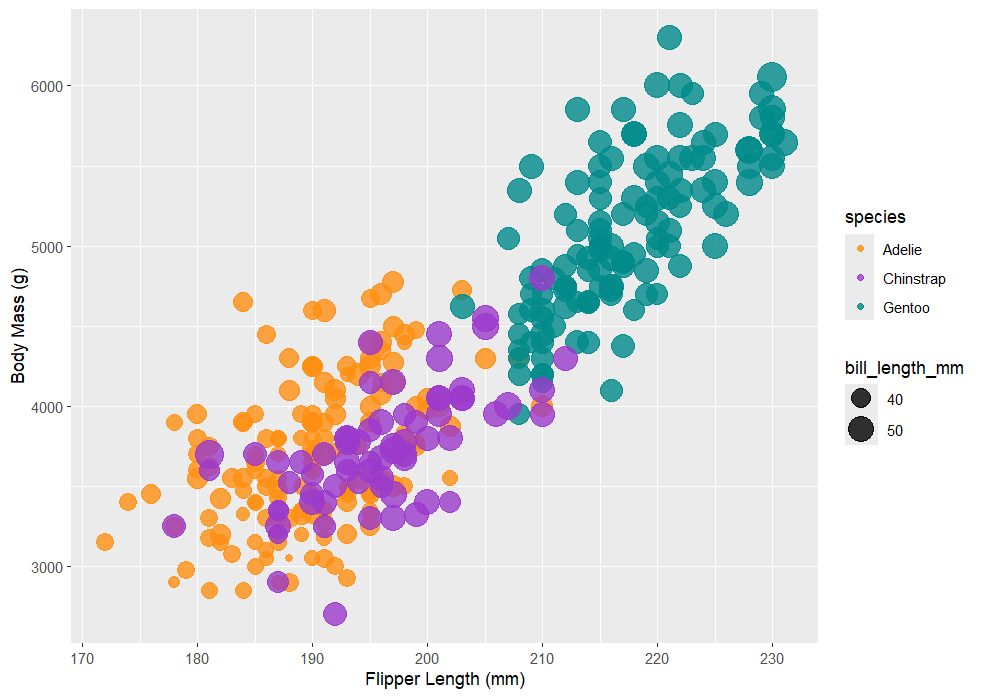
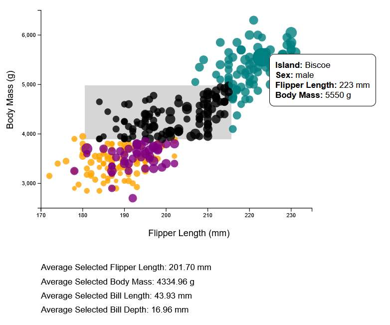
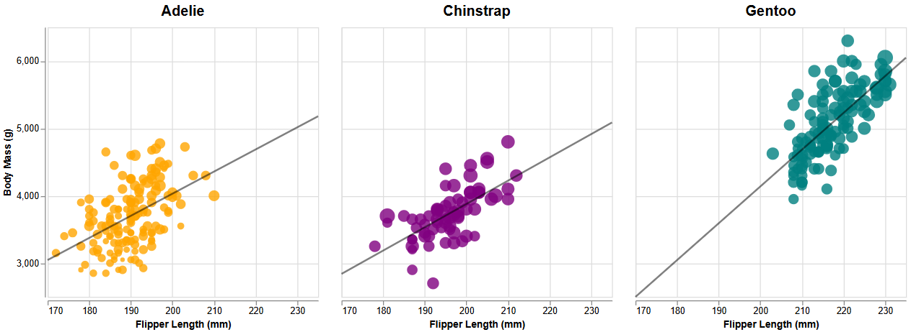

# 02-DataVis-5ways

# Vega-Lite
I already have some familiarity with Vega-Lite because of my work with it in my MQP, so the process of creating the visualization went pretty smoothly. Although I hadn't worked with scatterplots in Vega-Lite before, the documentation for the grammar is thorough yet easy to understand, so I was able to find the properties I needed to add to recreate the graph without too much trouble. After adding the reference to the CSV file in my Vega-Lite code, all I needed to change was the properties inside the "mark" property to get the visualization looking the same. The main problem I had was that when I changed the bill length legend to look like the example, the labels for "40" and "50" overlapped the symbols. I wasn't able to find a fix for this, since properties that sounded like they would fix it like "labelPadding" didn't seem to have any effect, so I instead removed the legend entirely.

I can definitely see Vega-Lite being used to create visualizations in many fields, as long as they don't need too much customization, since the ease of use makes up for its limits.

I started with the basic HTML file used on the "Embedding Vega-Lite" page on Vega's website.

# d3
Recreating the graph in D3 took some more getting used to than it did with Vega-Lite. I had to do some digging in the documentation to find what I was looking for (though I do appreciate the index tab that lets you ctrl + F to find specific sections), and the fact that most examples of functions were isolated and don't show their locations in code means that implementation of them can be a game of trial and error. Sometimes I'd find a few simple D3 examples online to see the functions I wanted to use in action, so I could use them myself. Defining scales that are then set to parts of the svg took longer to figure out than I think it should've because of how the documentation is set up, but once I got the hang of it they made recreating properties of the scatterplot fairly smooth. One difficulty was adding labels to the graphs, in which D3 doesn't have as simple as Vega-Lite's "title" property for axes. Instead, I had to create text objects and set their positions manually. One other difficulty I had was getting the ticks to look the same as the example. There is a ticks function with a start, stop, and count, but giving it a discrete start and stop messed up the count for me for some reason. If I gave it just a count variable it would work, but I'd need to provide the count necessary to get the x-axis to increment by 10, instead of being able to specify directly that I want it to increment by 10.

D3 is definitely useful for people familiar with programming, but it doesn't have the same intuitiveness that Vega-Lite does, which makes it have a steeper learning curve that may drive non-programmers away. But a benefit to D3 is that while implementing some features in the visualization was more difficult than in Vega-Lite, the way it's set up allows for a lot more customization. I can see D3 being useful for when a more specialized visualization is required and the team has someone with a web development background that won't take as long to get comfortable with D3.

I started with the code in the "D3 in Vanilla HTML" section of the "Getting started" tab on D3's documentation.

# Altair

Altair was just as intuitive as Vega-Lite was and the process of replicating the visualization went very smoothly. Using its syntax you can create the graph with concise code. With Altair, I could encode the X axis, Y axis, color, and size to their respective fields, and then add properties to them to customize them how I wanted. The legends for size and color were generated without any code, but could also be customized if need be. The only obstacle I faced was some issues with pip install when installing Altair, compared to Vega-Lite where I faced no problems when embedding it in an HTML site.

I can see Altair being useful in a similar way with Vega-Lite, where it's accessibility lowers the entry barrier for people looking to create a visualization. I believe that Vega-Lite would still be more appealing to non-programmers with their online editor and JSON syntax, but any team looking to create a quick but effective visualization wouldn't go wrong choosing Altair.

# Flourish
Flourish is the only tool I chose that doesn't require any coding or creating JSON objects, and is instead heavily GUI focused. While that does limit your options somewhat, there were enough to let me recreate the graph fairly accurately. I like the data tab, which lets you easily select which fields correlate to the X axis, Y axis, colors, size, etc. This plus the amount of options offers some decent customization. Though one drawback to the size variation is that despite setting the bill length field to the size of each point and the size variation from 10 to 350, the size difference between points is barely noticeable. This seems to be because it's scaling with the smallest size being 0 rather than the minimum bill length, so when referenced to 0, a bill length of 40 and 50 will look almost the same. Also, while I was able to create this graph for free, Flourish does have some paid features.

Although Vega-Lite and Altair are both intuitive in their syntax, I can still see them being intimidating to someone with no coding experience, and that they'd much prefer a tool with a GUI like Flourish. Although Flourish doesn't have the flexibility that other tools and libraries have, it has enough features that it would work well for a team in which no members have any experience programming.

# R + ggplot2
Out of all 5 visualization methods, I found this one to be the least intuitive. Though d3 is more complex, the syntax of it is easier to read at a glance and find out what they're doing. It might be partly because I'm not familiar with R, but I found it hard to navigate the documentation of ggplot with everything being short abbreviations, or even single letters, and it made creating the graph tougher as a newcomer to R. The benefits were that I didn't need to make any changes to get the ticks at reasonable intervals or have scales not start at 0, and its convenient that RStudio has its own tab for the graph, so I don't need to switch between tabs while working. While it does have good customization like Vega-Lite and Altair, the syntax structure would take some getting used to if I were to make a more complex visualization than this one with ggplot2.

This would likely be best for someone that's already familiar with R and could easily transfer their skills into creating visualizations. In that case, it will likely be easier to get a visualization started with ggplot2, as you can create a solid visualization with very little and tweak it from there. I don't feel like it would be a good recommendation to learn for complex visualizations, because ggplot2 would take some getting used to, and if you're going to learn a library, learning the more versatile d3 would likely be the preferable choice.

## Technical Achievements
- **Showing Data for Point Upon Hover in D3**: I made another version of the D3 visualization that adds some more interactivity to the graph. Upon hovering over a specific data point, it will show you that penguin's island, sex, flipper length, and body mass. Now users can see more data that wasn't present in the original visualization, and they can see the exact values of each point on the graph instead of only being able to estimate based on the location of the point.
- **Brushing Points to Show Averages in D3**: In the second D3 visualization, I also utilized the brush functionality to allow the user to find what the average measurements are for penguins in a certain section of the graph. By clicking and dragging, you'll create a box, and any points in the box will turn black to indicate that they're selected. The values at the bottom of the graph will change based on which points are selected, and they show the user the averages of the selected points and compare how the penguins' measurements correlate to each other in the selected section.

## Design Achievements
- **Consistency Across All Graphs**: For each chart, I made sure to recreate the original visualization as closely as I could. Each species is associated with the same color across all charts, the sizes of the points are as identical to the graph as I could get, and the tick mark increments and positions are the exact same across all charts. When replicating each chart, I did everything I could to prove the capabilities of recreating graphs in each library or tool.
- **Separate Plots with Line of Best Fit in Altair**: I made another version of the Altair chart that splits it into three separate graphs based on the species and also draws a line of best fit through each one. This offers another way of looking at the data: while the original graph makes it easy to compare the sizes of the species of penguins with each other, this way of visualizing it lets you look at each species separately and see the correlation between the flipper length and body mass based on a penguin's species. The X and Y axis are the same for each, so you can still compare sizes between species based on the general location of each specie's data points.

